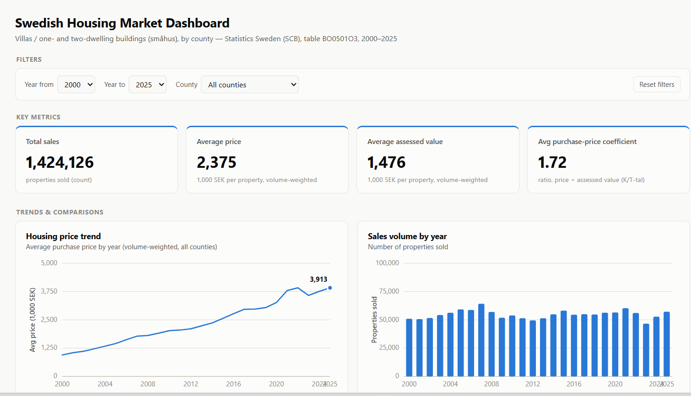

# Swedish Housing Market Dashboard

[](https://sehrishsaboor-source.github.io/housingproject/)
[](#tools--technologies)
[](LICENSE)

An interactive dashboard analyzing villa (småhus) sales prices across Swedish counties from 2000 to 2025, built on official government statistics from Statistics Sweden (SCB).

**Live dashboard:** https://sehrishsaboor-source.github.io/housingproject/



## Highlights

- **Full pipeline, not just a chart** — raw government CSV → cleaned & verified dataset → live, interactive, deployed dashboard
- **26 years × 21 counties** of official Statistics Sweden data (2000–2025), reshaped from a 105-column wide export into a clean analytical table
- **Zero dependencies** — every chart is hand-built with inline SVG in vanilla JavaScript; no charting library, no framework, no build step
- **Correct by construction** — KPIs are volume-weighted (not naive averages), so results aren't skewed by small counties
- **Deployed, not just coded** — a real, shareable URL via GitHub Pages, not a screenshot or a local notebook

## Overview

This project turns raw, wide-format government data into a clean, interactive, filterable dashboard that answers five core questions about the Swedish housing market:

- How have housing prices changed over time?
- Which counties have the highest and lowest housing prices?
- What is the average price per property?
- How many properties have been sold?
- How does a property's sale price compare to its assessed value?

It's built as a self-contained, dependency-free web page — no build step, no backend, no external services required to run it.

## Objectives

- Source and validate a real, public dataset rather than a toy or synthetic one
- Design a small but correct star-schema data model, then adapt it to a flat delivery format
- Build clear, honest data visualizations — volume-weighted metrics, labeled axes, and no chart types that misrepresent the data
- Ship a working, shareable, interactive result rather than a static report

## Data Source

**Statistics Sweden (SCB)**, Statistikdatabasen — table `BO0501O3`, *"Sold one- and two-dwelling buildings by region, observations and year"*.

- **Scope:** villas / one- and two-dwelling buildings for permanent living (småhus) — apartment/bostadsrätt data is a planned future addition, not included in this version
- **Granularity:** county level (21 Swedish counties), annual, 2000–2025
- **Measures:** number of properties sold, average purchase price, average assessed (tax) value, purchase-price coefficient (sale price ÷ assessed value)

The raw export is a wide, 105-column CSV (one column per measure × year). It was cleaned, re-encoded from Windows-1252 to UTF-8, and reshaped into a tidy county × year table before use — see [`docs/PROJECT_PLAN.md`](docs/PROJECT_PLAN.md) for the full data-prep methodology and the scope decisions made along the way (e.g. county- rather than municipality-level detail, because SCB doesn't publish reliable municipality-level averages for every year).

## Tools & Technologies

- **HTML / CSS / vanilla JavaScript** — the entire dashboard, including all charts, is hand-built with inline SVG (no charting library, no framework, no build tooling)
- **PowerShell** — data cleaning and reshaping (encoding conversion, wide-to-long transformation), verified cell-by-cell against the source
- **Git & GitHub** — version control and hosting
- **GitHub Pages** — free static hosting for the live, shareable link

## Features

- **4 KPI cards** — Total Sales, Average Price, Average Assessed Value, and Average Purchase-Price Coefficient, all volume-weighted (a plain average across counties would let a small county move the number as much as Stockholm)
- **4 charts** — price trend over time, sales volume by year, average price by county, and purchase-price coefficient by county — each with labeled axes, gridlines, and hover tooltips
- **Interactive filters** — year range and county selection, scoping every KPI and chart together
- **Light & dark mode**, responsive layout, and an accessible, colorblind-safe color palette

## Data Model

Designed as a star schema (a fact table of county × year measures, with County, Year, and PropertyType as dimensions), then intentionally flattened into a single table for delivery — the dimensional thinking is preserved in the design even though the final format is one denormalized table. Full details in [`docs/PROJECT_PLAN.md`](docs/PROJECT_PLAN.md).

## Technical Challenges & Decisions

A few real problems came up building this — and the decisions behind how they were solved:

- **Silent encoding corruption.** The SCB export was Windows-1252, not UTF-8; loaded naively, Swedish characters (å/ä/ö in county names like "Södermanland") would have rendered as garbage. Caught it before it reached the dashboard and re-encoded the source file.
- **A "successful" script that was actually wrong.** A first pass at reshaping the data (via Google Apps Script) ran without errors but produced silently misaligned rows — one county's year values ended up under another county's label. It was caught only by validating the output cell-by-cell against the source, not by trusting that "no error thrown" meant "correct." The reshape was rebuilt as a verified, testable script instead.
- **Wide-to-long reshaping.** The raw table had 105 columns (4 measures × 26 years). Rather than hand-editing, it was systematically parsed and pivoted into a tidy county × year table — the same transformation a `pandas.melt`/`pivot` or Power Query unpivot would do, done by hand to keep the project dependency-free.
- **Volume-weighted metrics, not naive averages.** Averaging the 21 counties' average prices directly would let a small county's price swing the headline number as much as Stockholm's. Every KPI is instead weighted by sales volume — the same principle behind a proper `SUMX(...)/SUM(...)` measure in a BI tool, applied here in plain JavaScript.
- **No charting library, on purpose.** Every chart is hand-rolled SVG rather than a dependency like Chart.js or D3 — a deliberate choice to keep the page self-contained and to demonstrate chart construction (scales, axes, tooltips, accessible color) from first principles rather than a library's defaults.

## Skills Demonstrated

`Data Sourcing` `Data Cleaning & ETL` `Data Modeling` `Star Schema Design` `Data Visualization` `JavaScript` `SVG` `HTML/CSS` `PowerShell` `Git & GitHub` `GitHub Pages` `Deployment` `Accessible Design` `Statistical/Government Data`

- **Sourcing & validation** — navigating a real government statistical database, reading its documentation, and choosing the right table and granularity for the question being asked
- **Data cleaning & ETL** — encoding fixes, wide-to-long reshaping, and validating output against source data rather than assuming a script "worked" because it ran
- **Data modeling** — star-schema design, then a deliberate, justified flattening decision for the delivery format
- **Data visualization** — correct metric design (volume-weighted averages), appropriate chart selection, labeled dimensions, and an accessible, colorblind-safe color system
- **Front-end development** — building interactive, filterable visualizations in vanilla JavaScript and SVG with zero dependencies
- **Version control & deployment** — Git, GitHub, and GitHub Pages, taken from local files to a real public URL

## Project Structure

```
HousingProject/
  data/
    raw/          original SCB export + UTF-8-corrected copy
    processed/    housing_flat.csv — the cleaned, reshaped table
  docs/
    PROJECT_PLAN.md   full project methodology, decisions, and roadmap
  index.html       the dashboard (self-contained)
  README.md        this file
```

## Roadmap

This is v1 — scoped deliberately small. Planned next:

- **v2:** apartment/bostadsrätt data alongside villas, municipality-level detail where available, quarterly granularity
- **v3:** an affordability index (price vs. income), a geographic map view, and richer year-over-year comparisons

See [`docs/PROJECT_PLAN.md`](docs/PROJECT_PLAN.md) for the full roadmap and the reasoning behind each scope decision.

## License

MIT — see [`LICENSE`](LICENSE).
